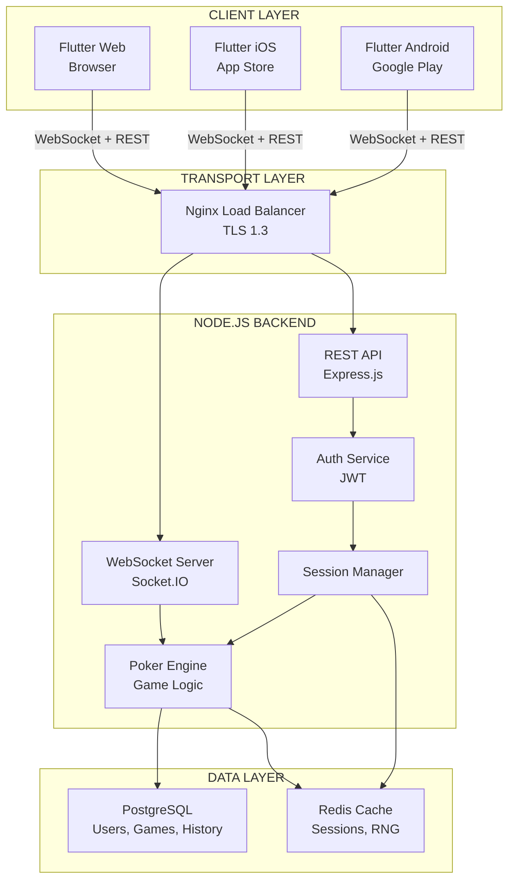

## Plan: Multi-Phase Multiplayer Poker App Development

**TL;DR:** Build a cross-platform multiplayer poker app using Flutter for iOS/Web/Android and Node.js + WebSockets for real-time backend. The plan spans 5 phases: architecture & setup, core backend infrastructure, poker engine, frontend UI/UX, and deployment. Each phase includes specific deliverables (system diagrams, API schemas, database design, security hardening) enabling sequential implementation.

---

## Phase Overview

### **Phase 1: Architecture Design & Project Setup**
Establish system architecture, monorepo structure, and foundational infrastructure.

**Deliverables:**
- System Architecture Diagram (Mermaid)
- Monorepo folder structure with clear separation of concerns
- Development environment setup documentation
- CI/CD pipeline configuration skeleton

---

### **Phase 2: Backend Core Infrastructure**
Build Node.js backend with WebSocket server, authentication, and database layer.

**Deliverables:**
- Backend API schema with REST endpoints and WebSocket event definitions
- PostgreSQL database schema (users, sessions, hand histories, game tables)
- Authentication & authorization system (JWT-based)
- WebSocket event emitter/listener framework
- User session management

---

### **Phase 3: Poker Engine & Game Logic**
Implement the core poker mechanics: RNG, hand evaluation, game state management.

**Deliverables:**
- Cryptographically secure shuffling algorithm (using Node's crypto module)
- Hand evaluation engine (Texas Hold'em logic)
- Game state machine (pre-flop, flop, turn, river, showdown)
- Pot calculation and chip distribution logic
- Hand history recording system

---

### **Phase 4: Frontend Development (Flutter)**
Build cross-platform UI with real-time synchronization.

**Deliverables:**
- Flutter project setup with platform-specific configurations (iOS, Android, Web)
- Login & account management screens
- Lobby UI with table browser and create/join functionality
- Game table UI with real-time player actions
- Hand history & profile pages
- WebSocket client integration layer

---

### **Phase 5: Security Hardening & Anti-Cheat**
Implement security measures and deploy to production.

**Deliverables:**
- Rate limiting and DDoS protection
- Multi-account detection system
- Real-time assistance (RTA) detection
- Secure random number generation verification
- Security audit & penetration testing
- Production deployment (server + app stores)

---

## Detailed Deliverables by Phase

### **PHASE 1: ARCHITECTURE DESIGN & PROJECT SETUP**

#### 1.1 System Architecture Diagram

```
┌─────────────────────────────────────────────────────────────────┐
│                        CLIENT LAYER                              │
├──────────────────┬──────────────────┬──────────────────────────┤
│  Flutter (Web)   │  Flutter (iOS)   │  Flutter (Android)       │
│  Browser         │  App Store       │  Google Play             │
└────────┬─────────┴────────┬─────────┴────────────┬─────────────┘
         │                  │                      │
         └──────────────────┼──────────────────────┘
                            │ (WebSocket + REST)
         ┌──────────────────▼──────────────────────┐
         │    Nginx / Load Balancer (TLS 1.3)     │
         └──────────────────┬──────────────────────┘
                            │
         ┌──────────────────▼──────────────────────┐
         │  Node.js Backend Cluster                │
         ├──────────────────────────────────────────┤
         │  • WebSocket Server (Socket.IO/native)  │
         │  • REST API (Express.js)                │
         │  • Game Engine (Poker Logic)            │
         │  • Session Manager                      │
         │  • Auth Service (JWT)                   │
         └──────────┬───────────────────┬──────────┘
                    │                   │
         ┌──────────▼──────┐  ┌────────▼──────────┐
         │  PostgreSQL DB  │  │  Redis Cache      │
         │  (Users, Games) │  │  (Sessions, RNG)  │
         └─────────────────┘  └───────────────────┘
```

**Mermaid Version:**


#### 1.2 Monorepo Folder Structure

```
poker-app-2026/
├── .github/
│   └── workflows/
│       ├── backend-ci.yml
│       ├── frontend-ci.yml
│       └── deploy-prod.yml
├── backend/
│   ├── src/
│   │   ├── server.js              # Main entry point
│   │   ├── config/
│   │   │   ├── database.js
│   │   │   ├── redis.js
│   │   │   └── env.js
│   │   ├── api/
│   │   │   ├── routes/
│   │   │   │   ├── auth.js
│   │   │   │   ├── users.js
│   │   │   │   ├── tables.js
│   │   │   │   └── games.js
│   │   │   ├── middleware/
│   │   │   │   ├── authMiddleware.js
│   │   │   │   ├── rateLimiter.js
│   │   │   │   └── errorHandler.js
│   │   │   └── controllers/
│   │   ├── websocket/
│   │   │   ├── socketHandler.js
│   │   │   ├── gameEvents.js
│   │   │   ├── playerEvents.js
│   │   │   └── eventEmitter.js
│   │   ├── game/
│   │   │   ├── engine.js          # Core poker logic
│   │   │   ├── hand-evaluator.js
│   │   │   ├── shuffler.js        # Cryptographic RNG
│   │   │   ├── gameState.js
│   │   │   └── potCalculator.js
│   │   ├── security/
│   │   │   ├── antiCheat.js
│   │   │   ├── multiAccountDetector.js
│   │   │   ├── rtaDetector.js
│   │   │   └── encryption.js
│   │   ├── models/
│   │   │   ├── User.js
│   │   │   ├── Game.js
│   │   │   ├── Table.js
│   │   │   ├── HandHistory.js
│   │   │   └── Session.js
│   │   └── utils/
│   │       ├── logger.js
│   │       └── validators.js
│   ├── tests/
│   │   ├── unit/
│   │   ├── integration/
│   │   └── game/
│   ├── migrations/
│   │   └── [numbered_migrations]
│   ├── package.json
│   ├── .env.example
│   └── README.md
│
├── frontend/
│   ├── lib/
│   │   ├── main.dart
│   │   ├── screens/
│   │   │   ├── login_screen.dart
│   │   │   ├── lobby_screen.dart
│   │   │   ├── table_screen.dart
│   │   │   ├── game_screen.dart
│   │   │   ├── profile_screen.dart
│   │   │   └── hand_history_screen.dart
│   │   ├── widgets/
│   │   │   ├── player_avatar.dart
│   │   │   ├── chip_stack.dart
│   │   │   ├── action_buttons.dart
│   │   │   ├── card_widget.dart
│   │   │   └── pot_display.dart
│   │   ├── services/
│   │   │   ├── websocket_service.dart
│   │   │   ├── api_service.dart
│   │   │   ├── auth_service.dart
│   │   │   └── game_service.dart
│   │   ├── models/
│   │   │   ├── user_model.dart
│   │   │   ├── game_model.dart
│   │   │   ├── player_model.dart
│   │   │   └── action_model.dart
│   │   ├── providers/
│   │   │   ├── game_provider.dart
│   │   │   ├── user_provider.dart
│   │   │   └── websocket_provider.dart
│   │   ├── constants/
│   │   │   ├── colors.dart
│   │   │   ├── strings.dart
│   │   │   └── api_endpoints.dart
│   │   └── theme/
│   │       └── app_theme.dart
│   ├── ios/
│   │   └── Podfile
│   ├── android/
│   │   ├── app/
│   │   └── build.gradle
│   ├── web/
│   │   └── index.html
│   ├── pubspec.yaml
│   ├── pubspec.lock
│   └── README.md
│
├── docs/
│   ├── ARCHITECTURE.md
│   ├── API_SCHEMA.md
│   ├── DATABASE_SCHEMA.md
│   ├── SECURITY_PLAN.md
│   ├── DEPLOYMENT.md
│   └── CONTRIBUTING.md
│
├── docker/
│   ├── Dockerfile.backend
│   ├── docker-compose.yml
│   └── .dockerignore
│
├── .gitignore
├── .env.example
└── README.md
```

#### 1.3 Development Environment Setup

**Key Configuration Files to Create:**

1. **Root `.env.example`** - Environment variables template
2. **Backend `package.json`** - Dependencies (Express, Socket.IO, PostgreSQL driver, crypto, etc.)
3. **Frontend `pubspec.yaml`** - Flutter dependencies (provider, http, web_socket_channel)
4. **Docker Compose** - Local development stack with PostgreSQL + Redis
5. **GitHub Actions** - CI/CD workflows for testing and deployment

---

### **PHASE 2: BACKEND CORE INFRASTRUCTURE**

#### 2.1 REST API Endpoint Schema

```
# Authentication
POST   /api/v1/auth/register          → Register new user
POST   /api/v1/auth/login             → Login (returns JWT)
POST   /api/v1/auth/refresh           → Refresh JWT token
POST   /api/v1/auth/logout            → Logout (invalidate session)
GET    /api/v1/auth/verify            → Verify token validity

# Users
GET    /api/v1/users/:userId          → Get user profile
PUT    /api/v1/users/:userId          → Update user profile
GET    /api/v1/users/:userId/balance  → Get account balance
POST   /api/v1/users/:userId/deposit  → Add chips (payment integration)
POST   /api/v1/users/:userId/withdraw → Cash out chips

# Tables/Lobbies
GET    /api/v1/tables                 → List all active tables
POST   /api/v1/tables                 → Create new table
GET    /api/v1/tables/:tableId        → Get table details
POST   /api/v1/tables/:tableId/join   → Request to join table
DELETE /api/v1/tables/:tableId/leave  → Leave table
GET    /api/v1/tables/:tableId/seats  → Get seat availability

# Games
GET    /api/v1/games/:gameId          → Get game details
GET    /api/v1/games/:gameId/history  → Get hand history
GET    /api/v1/users/:userId/history  → Get user's hand histories

# Statistics
GET    /api/v1/users/:userId/stats    → Get player statistics
GET    /api/v1/leaderboard            → Global leaderboard
```

#### 2.2 WebSocket Event Schema

```javascript
// Client → Server Events
{
  "events": {
    "PLAYER_ACTION": {
      "description": "Player makes action (fold, check, call, raise, all-in)",
      "payload": {
        "tableId": "uuid",
        "playerId": "uuid",
        "action": "fold|check|call|raise|all_in",
        "amount": 100,
        "timestamp": "ISO8601"
      }
    },
    "PLAYER_READY": {
      "description": "Player ready for next hand",
      "payload": {
        "tableId": "uuid",
        "playerId": "uuid"
      }
    },
    "CHAT_MESSAGE": {
      "description": "Table chat message",
      "payload": {
        "tableId": "uuid",
        "playerId": "uuid",
        "message": "string",
        "timestamp": "ISO8601"
      }
    }
  }
}

// Server → Client Events
{
  "events": {
    "GAME_STATE": {
      "description": "Current game state broadcast",
      "payload": {
        "tableId": "uuid",
        "handId": "uuid",
        "stage": "pre_flop|flop|turn|river|showdown",
        "players": [
          {
            "playerId": "uuid",
            "position": 0,
            "stack": 5000,
            "bet": 50,
            "folded": false,
            "allIn": false
          }
        ],
        "communityCards": ["2h", "Kd", "Qs"],
        "pot": 200,
        "actionOn": "uuid",
        "timeToAct": 30,
        "timestamp": "ISO8601"
      }
    },
    "PLAYER_ACTION_BROADCAST": {
      "description": "Broadcast of player action to all at table",
      "payload": {
        "tableId": "uuid",
        "playerId": "uuid",
        "action": "fold|check|call|raise",
        "amount": 100,
        "timestamp": "ISO8601"
      }
    },
    "HAND_RESULT": {
      "description": "Result of completed hand",
      "payload": {
        "tableId": "uuid",
        "handId": "uuid",
        "winners": [
          {
            "playerId": "uuid",
            "hand": ["As", "Kh"],
            "bestHand": "Pair of Kings",
            "winAmount": 500
          }
        ],
        "allHands": {
          "playerId": ["2c", "3d"]
        }
      }
    },
    "TABLE_UPDATED": {
      "description": "Table configuration or player list changed",
      "payload": {
        "tableId": "uuid",
        "seats": [
          {
            "position": 0,
            "playerId": "uuid",
            "stack": 5000,
            "empty": false
          }
        ],
        "minBuyIn": 10,
        "maxBuyIn": 1000,
        "smallBlind": 0.5,
        "bigBlind": 1
      }
    },
    "ERROR": {
      "description": "Error response",
      "payload": {
        "code": "INVALID_ACTION|INSUFFICIENT_BALANCE|GAME_NOT_FOUND",
        "message": "string"
      }
    }
  }
}
```

#### 2.3 PostgreSQL Database Schema

```sql
-- Users Table
CREATE TABLE users (
  id UUID PRIMARY KEY DEFAULT gen_random_uuid(),
  username VARCHAR(255) UNIQUE NOT NULL,
  email VARCHAR(255) UNIQUE NOT NULL,
  password_hash VARCHAR(255) NOT NULL,
  account_balance DECIMAL(15,2) DEFAULT 0,
  total_balance DECIMAL(15,2) DEFAULT 0,
  created_at TIMESTAMP DEFAULT CURRENT_TIMESTAMP,
  updated_at TIMESTAMP DEFAULT CURRENT_TIMESTAMP,
  last_login TIMESTAMP,
  is_active BOOLEAN DEFAULT TRUE,
  device_fingerprint VARCHAR(255) UNIQUE,
  ip_address INET
);

-- Sessions Table
CREATE TABLE sessions (
  id UUID PRIMARY KEY DEFAULT gen_random_uuid(),
  user_id UUID NOT NULL REFERENCES users(id) ON DELETE CASCADE,
  token_hash VARCHAR(255) UNIQUE NOT NULL,
  device_id VARCHAR(255),
  ip_address INET,
  user_agent TEXT,
  expires_at TIMESTAMP NOT NULL,
  created_at TIMESTAMP DEFAULT CURRENT_TIMESTAMP,
  is_active BOOLEAN DEFAULT TRUE
);

-- Tables (Game Tables)
CREATE TABLE game_tables (
  id UUID PRIMARY KEY DEFAULT gen_random_uuid(),
  name VARCHAR(255) NOT NULL,
  small_blind DECIMAL(10,4) NOT NULL,
  big_blind DECIMAL(10,4) NOT NULL,
  min_buy_in DECIMAL(10,4) NOT NULL,
  max_buy_in DECIMAL(10,4) NOT NULL,
  max_seats INT DEFAULT 6,
  current_players INT DEFAULT 0,
  game_type VARCHAR(50) DEFAULT 'CASH', -- CASH, TOURNAMENT, SNG
  status VARCHAR(50) DEFAULT 'WAITING', -- WAITING, RUNNING, CLOSED
  created_at TIMESTAMP DEFAULT CURRENT_TIMESTAMP,
  created_by UUID REFERENCES users(id)
);

-- Table Seats
CREATE TABLE table_seats (
  id UUID PRIMARY KEY DEFAULT gen_random_uuid(),
  table_id UUID NOT NULL REFERENCES game_tables(id) ON DELETE CASCADE,
  player_id UUID REFERENCES users(id),
  position INT NOT NULL,
  stack DECIMAL(15,4),
  is_seated BOOLEAN DEFAULT FALSE,
  joined_at TIMESTAMP
);

-- Games/Hands
CREATE TABLE games (
  id UUID PRIMARY KEY DEFAULT gen_random_uuid(),
  table_id UUID NOT NULL REFERENCES game_tables(id),
  hand_number INT,
  game_start_time TIMESTAMP NOT NULL,
  game_end_time TIMESTAMP,
  button_position INT,
  small_blind_position INT,
  big_blind_position INT,
  final_pot DECIMAL(15,4),
  winner_id UUID REFERENCES users(id),
  status VARCHAR(50) -- 'IN_PROGRESS', 'COMPLETED', 'CANCELLED'
);

-- Hand History (Actions)
CREATE TABLE hand_history (
  id UUID PRIMARY KEY DEFAULT gen_random_uuid(),
  game_id UUID NOT NULL REFERENCES games(id) ON DELETE CASCADE,
  action_order INT,
  player_id UUID NOT NULL REFERENCES users(id),
  action VARCHAR(50) NOT NULL, -- 'FOLD', 'CHECK', 'CALL', 'RAISE', 'ALL_IN'
  amount DECIMAL(15,4),
  street VARCHAR(50), -- 'PRE_FLOP', 'FLOP', 'TURN', 'RIVER', 'SHOWDOWN'
  timestamp TIMESTAMP DEFAULT CURRENT_TIMESTAMP
);

-- Player Cards (hole cards - encrypted)
CREATE TABLE player_cards (
  id UUID PRIMARY KEY DEFAULT gen_random_uuid(),
  game_id UUID NOT NULL REFERENCES games(id),
  player_id UUID NOT NULL REFERENCES users(id),
  card_1 VARCHAR(2),
  card_2 VARCHAR(2),
  created_at TIMESTAMP DEFAULT CURRENT_TIMESTAMP
);

-- Community Cards
CREATE TABLE community_cards (
  id UUID PRIMARY KEY DEFAULT gen_random_uuid(),
  game_id UUID NOT NULL REFERENCES games(id),
  card_position INT, -- 0-2 = Flop, 3 = Turn, 4 = River
  card VARCHAR(2),
  created_at TIMESTAMP DEFAULT CURRENT_TIMESTAMP
);

-- Game Results
CREATE TABLE game_results (
  id UUID PRIMARY KEY DEFAULT gen_random_uuid(),
  game_id UUID NOT NULL REFERENCES games(id),
  player_id UUID REFERENCES users(id),
  player_position INT,
  hole_cards VARCHAR(5),
  best_hand VARCHAR(100),
  final_stack DECIMAL(15,4),
  win_amount DECIMAL(15,4),
  finish_position INT
);

-- RNG Audit Log (for verifying shuffle randomness)
CREATE TABLE rng_audit (
  id UUID PRIMARY KEY DEFAULT gen_random_uuid(),
  game_id UUID REFERENCES games(id),
  seed_hash VARCHAR(255),
  deck_hash VARCHAR(255),
  created_at TIMESTAMP DEFAULT CURRENT_TIMESTAMP
);

-- Anti-Cheat Flags
CREATE TABLE cheat_detection (
  id UUID PRIMARY KEY DEFAULT gen_random_uuid(),
  user_id UUID NOT NULL REFERENCES users(id),
  detection_type VARCHAR(100), -- 'MULTI_ACCOUNT', 'RTA', 'COLLUSION', 'UNUSUAL_PATTERN'
  severity VARCHAR(50), -- 'LOW', 'MEDIUM', 'HIGH'
  details JSONB,
  flagged_at TIMESTAMP DEFAULT CURRENT_TIMESTAMP,
  resolved BOOLEAN DEFAULT FALSE
);

-- Create Indexes
CREATE INDEX idx_users_username ON users(username);
CREATE INDEX idx_users_email ON users(email);
CREATE INDEX idx_sessions_user_id ON sessions(user_id);
CREATE INDEX idx_sessions_token_hash ON sessions(token_hash);
CREATE INDEX idx_games_table_id ON games(table_id);
CREATE INDEX idx_games_winner_id ON games(winner_id);
CREATE INDEX idx_hand_history_game_id ON hand_history(game_id);
CREATE INDEX idx_hand_history_player_id ON hand_history(player_id);
CREATE INDEX idx_cheat_detection_user_id ON cheat_detection(user_id);
```

#### 2.4 Authentication & Session Management

**JWT Token Structure:**
```json
{
  "header": {
    "alg": "HS256",
    "typ": "JWT"
  },
  "payload": {
    "sub": "user_id_uuid",
    "username": "username",
    "email": "user@example.com",
    "iat": 1674067200,
    "exp": 1674153600,
    "device_fingerprint": "hash",
    "session_id": "session_uuid"
  }
}
```

**Session Validation:**
- Verify JWT signature
- Check token expiration
- Validate session record in database
- Cross-check device fingerprint
- Track IP address changes for suspicious activity

---

### **PHASE 3: POKER ENGINE & GAME LOGIC**

#### 3.1 Cryptographically Secure Shuffling Algorithm

```javascript
/**
 * Secure RNG using Node.js crypto module
 * Algorithm: Fortuna (via crypto.randomBytes)
 * Seed verification: SHA-256 hash stored for audit trail
 */
class SecureShuffler {
  static async generateDeck() {
    // Create standard 52-card deck
    const suits = ['h', 'd', 'c', 's'];
    const ranks = ['2','3','4','5','6','7','8','9','T','J','Q','K','A'];
    const deck = [];
    
    for (let suit of suits) {
      for (let rank of ranks) {
        deck.push(rank + suit);
      }
    }
    
    return deck;
  }

  static async shuffleDeck(deck) {
    // Fisher-Yates shuffle with crypto.randomBytes
    const shuffled = [...deck];
    
    for (let i = shuffled.length - 1; i > 0; i--) {
      const randomBytes = crypto.randomBytes(4);
      const j = randomBytes.readUInt32BE(0) % (i + 1);
      [shuffled[i], shuffled[j]] = [shuffled[j], shuffled[i]];
    }
    
    return shuffled;
  }

  static async generateSeedHash() {
    // For audit: commitment before shuffle
    const seed = crypto.randomBytes(32);
    const hash = crypto.createHash('sha256').update(seed).digest('hex');
    return { seed, hash };
  }
}
```

#### 3.2 Hand Evaluation Engine (Texas Hold'em)

```javascript
/**
 * Hand Rankings (highest to lowest):
 * 10 - Royal Flush (A-K-Q-J-10, same suit)
 * 9  - Straight Flush (5 consecutive cards, same suit)
 * 8  - Four of a Kind
 * 7  - Full House (3 of a kind + pair)
 * 6  - Flush (5 cards of same suit)
 * 5  - Straight (5 consecutive cards)
 * 4  - Three of a Kind
 * 3  - Two Pair
 * 2  - One Pair
 * 1  - High Card
 */
class HandEvaluator {
  static evaluateBestHand(holeCards, communityCards) {
    // Generate all 5-card combinations from 7 cards
    // Evaluate each combination
    // Return best hand ranking with kickers for tie-breaking
  }

  static getRankValue(card) {
    const ranks = {
      '2': 2, '3': 3, '4': 4, '5': 5, '6': 6, '7': 7,
      '8': 8, '9': 9, 'T': 10, 'J': 11, 'Q': 12, 'K': 13, 'A': 14
    };
    return ranks[card[0]];
  }

  static getSuitValue(card) {
    return card[1]; // 'h', 'd', 'c', 's'
  }

  static isFlush(cards) {
    const suits = cards.map(c => c[1]);
    return new Set(suits).size === 1;
  }

  static isStraight(cards) {
    const ranks = cards.map(c => this.getRankValue(c)).sort((a, b) => b - a);
    // Check consecutive sequence
  }

  // Additional helper methods for each hand type
}
```

#### 3.3 Game State Machine

```javascript
/**
 * Game Flow:
 * 1. PRE_GAME → Wait for 2+ players
 * 2. PRE_FLOP → Small blind, big blind posted
 * 3. FLOP → 3 community cards revealed
 * 4. TURN → 4th community card revealed
 * 5. RIVER → 5th community card revealed
 * 6. SHOWDOWN → Compare hands, determine winner
 * 7. HAND_COMPLETE → Pay out chips, prepare next hand
 */
class GameStateMachine {
  constructor(tableId, playersArray) {
    this.tableId = tableId;
    this.players = playersArray;
    this.state = 'PRE_GAME';
    this.deck = [];
    this.communityCards = [];
    this.pot = 0;
    this.currentBetLevel = 0;
    this.actionIndex = 0;
  }

  async startGame() {
    // Deal hole cards
    // Move to PRE_FLOP
    // Small blind posts
  }

  async processBetRound() {
    // Process all player actions for current street
    // Validate action legality
    // Update pot
    // Check for early termination (all folded except 1)
  }

  async advanceStreet() {
    // Move to next street
    // Deal community cards
    // Reset bet level
  }

  async determineWinner() {
    // Evaluate all remaining hands
    // Distribute pot
    // Record hand history
  }
}
```

#### 3.4 Pot Calculation Logic

```javascript
class PotCalculator {
  constructor() {
    this.mainPot = 0;
    this.sidePots = []; // For all-in scenarios
  }

  addBet(playerId, amount) {
    // Track individual contributions
    // Calculate main/side pots if all-in situations exist
  }

  calculatePotDistribution(winners) {
    // Determine eligible pots for each winner
    // Handle side pot distribution
  }

  // Handle rake (commission to house)
  calculateRake(potSize) {
    const rakePercent = 0.03; // 3% house rake
    return potSize * rakePercent;
  }
}
```

---

### **PHASE 4: FRONTEND DEVELOPMENT (FLUTTER)**

#### 4.1 Key Flutter Screens & Widgets

**Core Screens:**
1. **LoginScreen** - User authentication
2. **LobbyScreen** - Browse tables, statistics, account balance
3. **TableScreen** - Sit down, watch, or join game
4. **GameScreen** - Main game interface with:
   - Player avatars and stacks (all seats)
   - Community cards in center
   - User's hole cards (bottom)
   - Pot and bet information
   - Action buttons (Fold, Check, Call, Raise, All-in)
   - Action timer
5. **ProfileScreen** - User stats, deposit/withdrawal
6. **HandHistoryScreen** - Review past games

**Custom Widgets:**
- `CardWidget` - Render playing cards with Impeller graphics
- `ChipStack` - Animated chip display
- `PlayerAvatar` - Player info display with status
- `ActionButtons` - Dynamic button enabling based on game state
- `PotDisplay` - Current pot visualization
- `AnimatedCardDeal` - Card dealing animation

#### 4.2 WebSocket Integration Pattern

```dart
// Example: Game Service with WebSocket listener
class GameService {
  final WebSocketService _wsService;
  final GameProvider _gameProvider;

  void listenToGameEvents(String tableId) {
    _wsService.on('GAME_STATE', (data) {
      _gameProvider.updateGameState(GameState.fromJson(data));
    });

    _wsService.on('PLAYER_ACTION_BROADCAST', (data) {
      _gameProvider.addAction(PlayerAction.fromJson(data));
    });

    _wsService.on('HAND_RESULT', (data) {
      _gameProvider.showHandResult(HandResult.fromJson(data));
    });

    _wsService.on('ERROR', (data) {
      _showError(data['message']);
    });
  }

  Future<void> sendPlayerAction(
    String tableId,
    String action,
    double amount,
  ) async {
    _wsService.emit('PLAYER_ACTION', {
      'tableId': tableId,
      'action': action,
      'amount': amount,
      'timestamp': DateTime.now().toIso8601String(),
    });
  }
}
```

#### 4.3 State Management with Provider

```dart
// Example: GameProvider for managing game state
class GameProvider extends ChangeNotifier {
  GameState _gameState;
  List<PlayerAction> _actions = [];
  
  void updateGameState(GameState newState) {
    _gameState = newState;
    notifyListeners();
  }

  void addAction(PlayerAction action) {
    _actions.add(action);
    notifyListeners();
  }
}
```

---

### **PHASE 5: SECURITY HARDENING & ANTI-CHEAT**

#### 5.1 Multi-Account Detection

```javascript
/**
 * Fingerprint Components:
 * - Device ID (hardware)
 * - IP Address + Subnet
 * - Browser/User-Agent
 * - Timezone & Locale
 * - Screen resolution
 * - WebGL/Hardware capabilities
 */
class MultiAccountDetector {
  static async generateDeviceFingerprint(req) {
    const fingerprint = {
      ipAddress: req.ip,
      userAgent: req.headers['user-agent'],
      timezone: req.body.timezone,
      deviceId: req.body.deviceId, // From Flutter
    };

    const hash = crypto
      .createHash('sha256')
      .update(JSON.stringify(fingerprint))
      .digest('hex');

    return hash;
  }

  static async detectLinkedAccounts(userIds) {
    // Find users with matching fingerprints
    // Flag for review if same fingerprint = multiple accounts
  }

  static async flagSuspiciousActivity(userId, reason) {
    // Log to cheat_detection table with details
    // Escalate to admin if confidence high
  }
}
```

#### 5.2 Real-Time Assistance (RTA) Detection

```javascript
/**
 * RTA Detection Signals:
 * - Inhuman reaction times (< 200ms consistently)
 * - Perfect pot odds decision-making
 * - Non-standard bet sizing patterns
 * - Correlation with external data streams
 * - Behavioral anomalies in AI profiling
 */
class RTADetector {
  static async analyzeActionPatterns(playerId, actions) {
    // Time-series analysis of decision-making
    // Machine learning model trained on legitimate play patterns
    // Flag anomalies
  }

  static async detectHumanBehavior(reactionTimes) {
    // Human reaction time typically 200-2000ms
    // Flag if consistently outside range
    const avgTime = reactionTimes.reduce((a, b) => a + b) / reactionTimes.length;
    
    if (avgTime < 150 || reactionTimes.every(t => t < 300)) {
      return 'POSSIBLE_BOT_OR_ASSISTANCE';
    }
    return 'HUMAN_BEHAVIOR';
  }
}
```

#### 5.3 Rate Limiting & DDoS Protection

```javascript
// Example: Rate limiter middleware
const rateLimit = require('express-rate-limit');

const loginLimiter = rateLimit({
  windowMs: 15 * 60 * 1000, // 15 minutes
  max: 5, // 5 attempts
  message: 'Too many login attempts, try again later',
});

const apiLimiter = rateLimit({
  windowMs: 60 * 1000, // 1 minute
  max: 100, // 100 requests per minute per IP
});

app.post('/api/v1/auth/login', loginLimiter, authController.login);
app.use('/api/v1/', apiLimiter);
```

#### 5.4 Deployment & Security Checklist

**Pre-Production:**
- [ ] Enable HTTPS/TLS 1.3 on all endpoints
- [ ] Implement CSRF tokens for form submissions
- [ ] Set secure HTTP headers (HSTS, CSP, X-Frame-Options)
- [ ] Database encryption at rest (PostgreSQL pgcrypto)
- [ ] Secrets management (environment variables, AWS Secrets Manager)
- [ ] SQL injection prevention (parameterized queries - already using ORM)
- [ ] XSS prevention (input validation, output encoding)
- [ ] Implement 2FA for user accounts (TOTP)
- [ ] API key rotation policy
- [ ] Audit logging for all sensitive operations
- [ ] Penetration testing & security audit
- [ ] DDoS mitigation (Cloudflare, AWS Shield)
- [ ] Game fairness certification (third-party RNG audit)

**Post-Deployment:**
- [ ] Real-time monitoring & alerting (DataDog, New Relic)
- [ ] Log aggregation (ELK stack, Splunk)
- [ ] Incident response playbook
- [ ] Regular security patches & updates
- [ ] Monthly compliance audits
- [ ] User data privacy compliance (GDPR, etc.)

---

## Implementation Roadmap

| Phase | Duration | Key Milestones |
|-------|----------|-----------------|
| **Phase 1** | Weeks 1-2 | Architecture finalized, monorepo setup, CI/CD pipelines |
| **Phase 2** | Weeks 3-5 | Backend API complete, DB schema, basic WebSocket |
| **Phase 3** | Weeks 6-8 | Hand evaluator tested, game state machine working, RNG verified |
| **Phase 4** | Weeks 9-13 | Flutter UI complete, WebSocket integration, cross-platform builds |
| **Phase 5** | Weeks 14-16 | Security hardening, anti-cheat implementation, testnet launch |

---

## Further Considerations

1. **Payment Processing** - Integrate Stripe/PayPal for real money transactions? Or use in-game tokens only? Consider gambling regulations by jurisdiction.

2. **Tournament Support** - Current plan focuses on cash games. Should tournaments be added later, or included in initial scope?

3. **Accessibility Standards** - WCAG 2.1 AA compliance for web version and iOS accessibility guidelines?

4. **Multiplayer Scaling** - Expected concurrent user count? Plan uses single backend initially; consider horizontal scaling (load balancing, database sharding) if > 10K concurrent users needed.

5. **Responsible Gaming** - Add session time limits, loss limits, self-exclusion options to comply with gambling regulations?

---

**This plan is ready for implementation. Respond with "Implement Phase X" to generate the actual code.**
